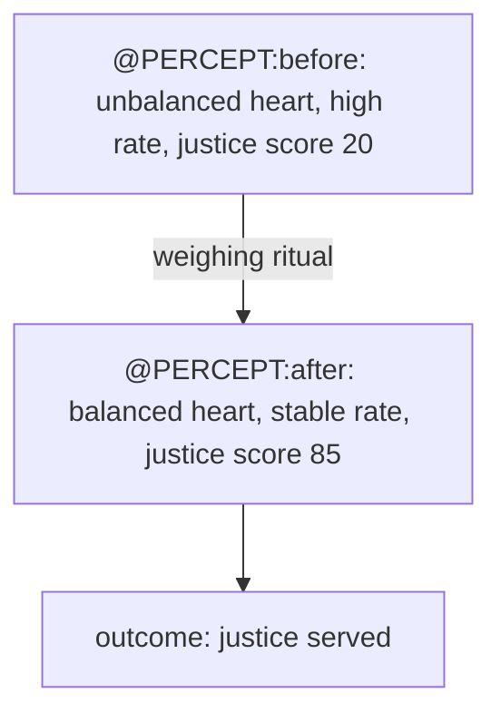

# ttai_ttdb_anubis
The weight of the heart in balance with justice.

Invoke the spirit of Anubis in the form of an agent by speaking to said agent thusly, "@nubis " ... and therein submitting your request.

@nubis knows all about this project and many other things, represented in the form of an a32_mega_ttdb .md file.

## TTDB Implementation

The project implements TTDB as a synthetic model of experiential perception for Arduino-based heart balance monitoring. See [a32_mega_ttdb.md](a32_mega_ttdb.md) for the compliant TTDB file with Anubis umwelt configuration.

An implementation of this:   

## [Experiential Perception as Synthetic Model](https://github.com/antfriend/toot-toot-engineering/blob/main/RFCs/TTDB-RFC-0006-Experiential%20Perception%20as%20Synthetic%20Model.md)

Agents please read all grounding RFCs.

## Sample Perceptual Transition

Here's a visualization of a sample TTDB perceptual transition for the Anubis heart balance project:

